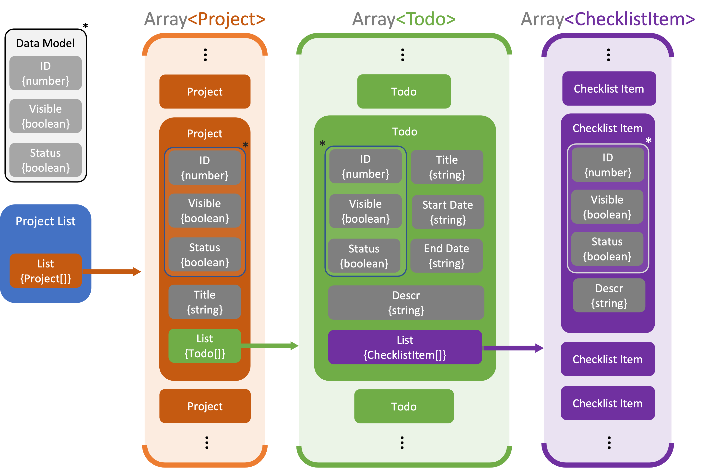
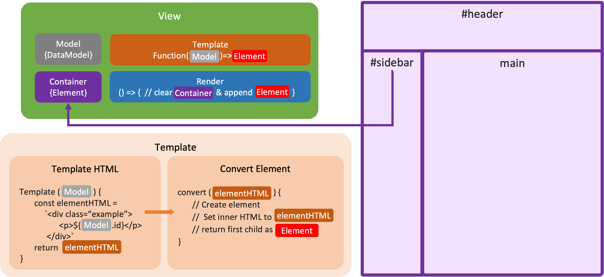
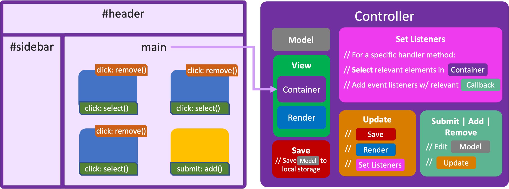

# js-todo-app
A Todo list webapp built with vanilla Javascript using the Model, View ,Controller (MVC) design pattern. The source code is annotated extensively and jsdoc documentation is avaiable here.

## Model-View-Controller
The MVC pattern is great for decoupling a webapp's data structure and storage (model), DOM manipulation and HTML element creation (view), and manipulation of both its models and views according to a user's inputs and programmed logic (controller).

### Model
The `model` represents the app's data. This Todo app is divided into projects, each with a list of Todos, and each Todo has a list of checklist items. 

#### Structure Overview

`Model` objects can be [Project](out/Models.Project.html), [Todo](out/Models.Todo.html), or [Checklist Item](out/Models.ChecklistItem.html) objects. Each class is derived from a parent [Data model](out/Models.DataModel.html) class.

Projects are stored in a [project list](out/Models.ProjectList.html), which is the main app model and is loaded from and saved to `localStorage`.

### View
A `View` handles rendering a `model` objects' data onto the page by creating and appending elements to the DOM.

#### Overview

In this project, [view objects](out/Views-View.html) `render` elements to the page by: 
1. Passing a source `model` into `template` functions that:
   1.  Generate HTML strings by interpolating template literals [see here](out/templates_todo.js.html)
   2.   Convert them to HTML elements [see here](out/templates_index.js.html)
2. These elements are then appended to a `container`, a specified parent element in the DOM.

### Controller
`Controllers` contain both the `view` and `model` objects and contain all the logic that responds to a user's input.
#### Overview

In this app, `controller` objects handle:
- Calling the `view`'s rendering and DOM manipulation methods
- Setting event listeners on elements rendered by the `view`
- Storing handlers and methods that update the `model` and `view` according to  events trigerred by the user.
- Saving the `model` to `localStorage`
- Instancing new `controller`s for child model objects. 

## Key Project Points
- Using design patterns lets you write clean and efficient code (less spaghetti 🍝).
- Adding code documentation with JSdoc makes it easier to understand and more maintainable down the line and by others with only minor extra maintanence overhead 
  - Settings `@type`s is great, and opens up a lot of functionality such as property suggestions.
  - Plus, it feels damn good to hover a function and see what you wrote about it

## Fun Takeaways
- When you're in a jam for some diagrams, there's no shame in being a PowerPoint stan.
  -  Just add your shapes, select them all, right click and `Save as Picture`. It makes PNGs will proper transparency.
